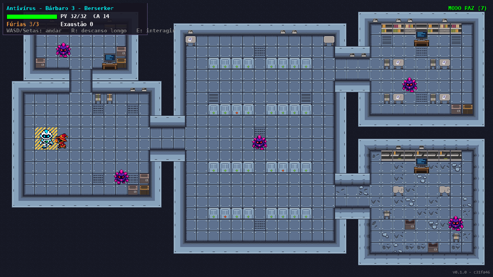
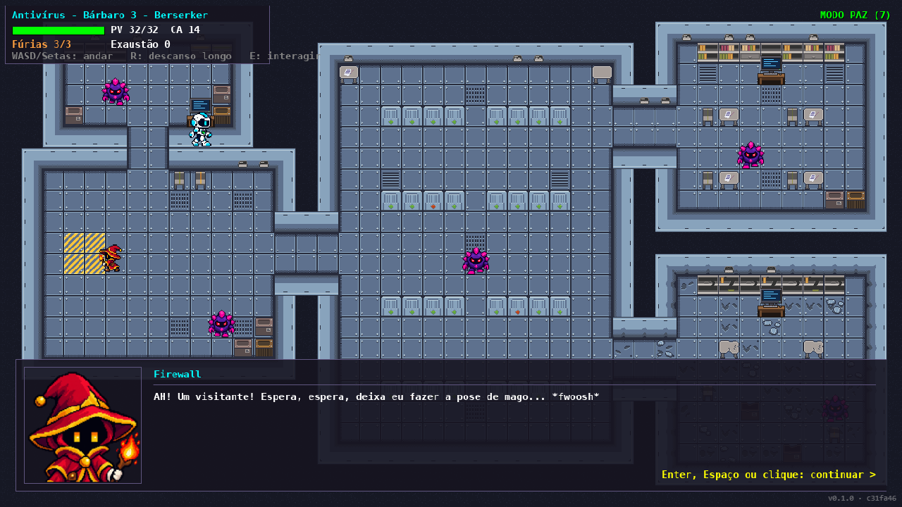
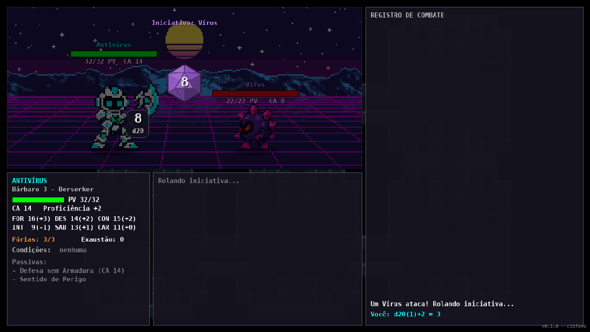
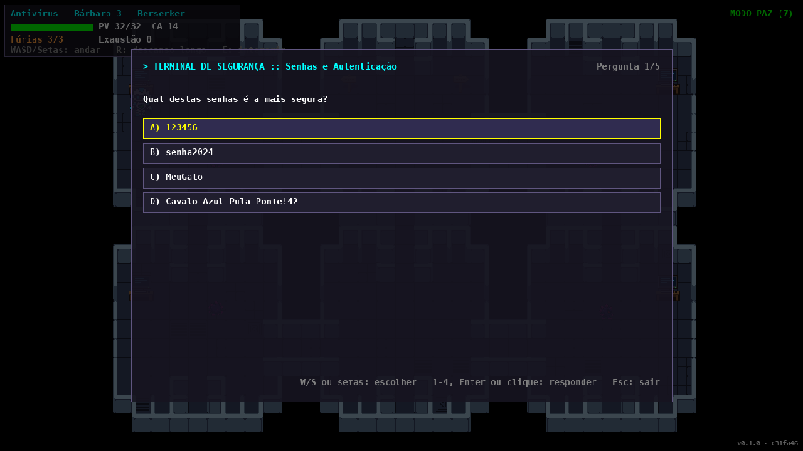
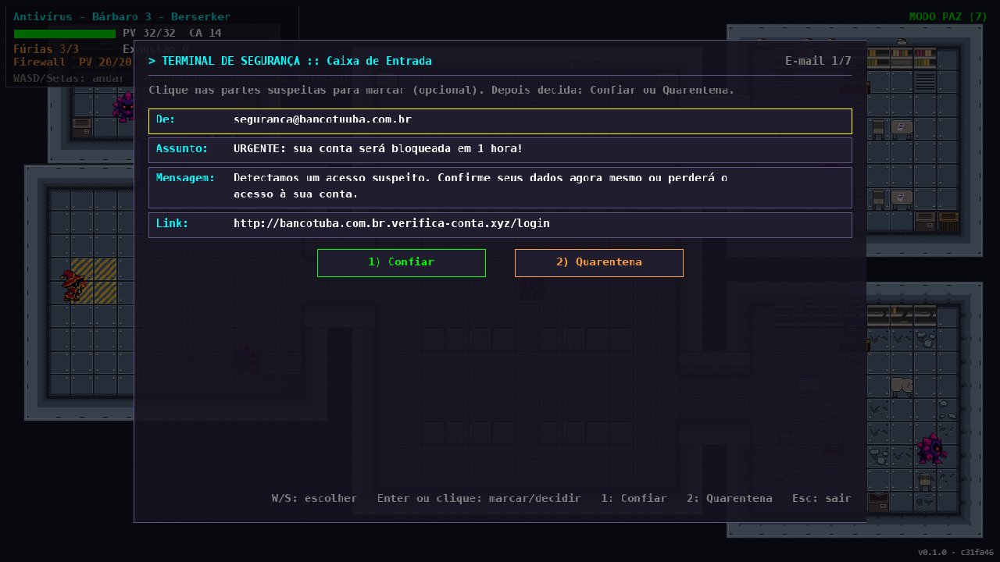
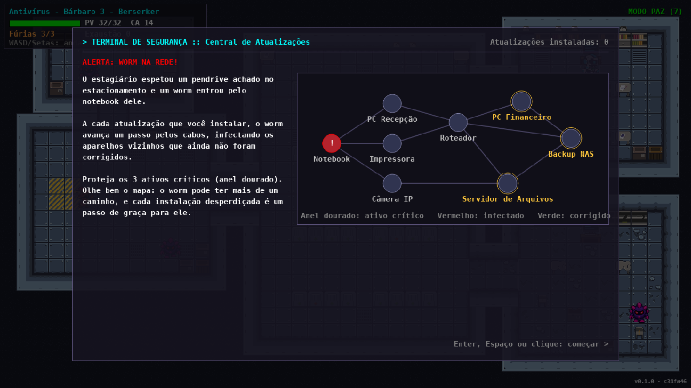
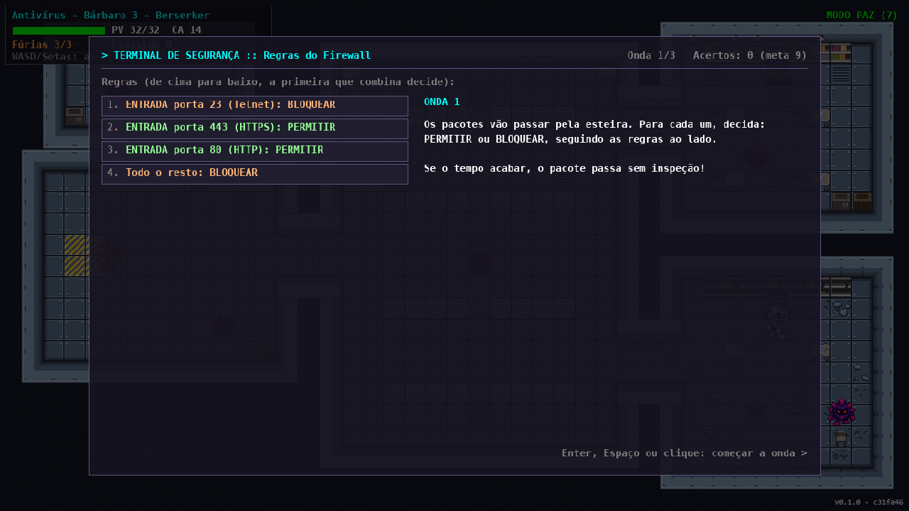
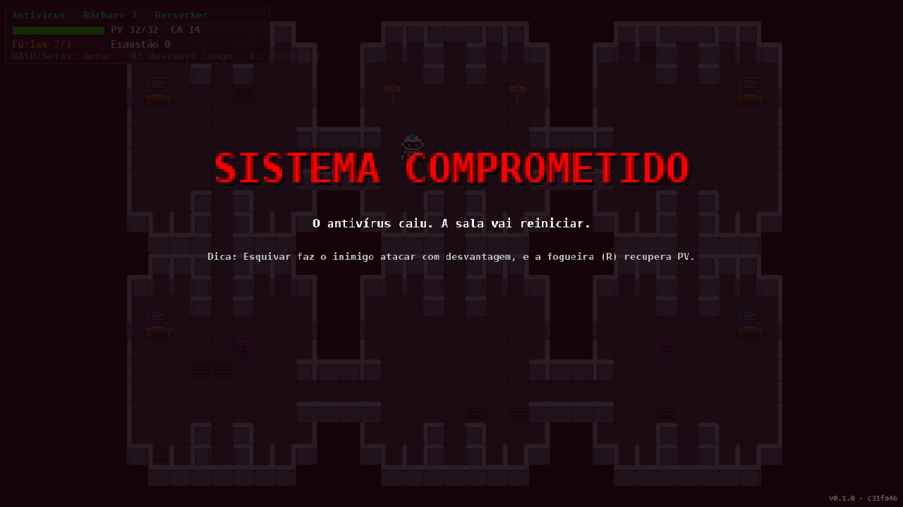
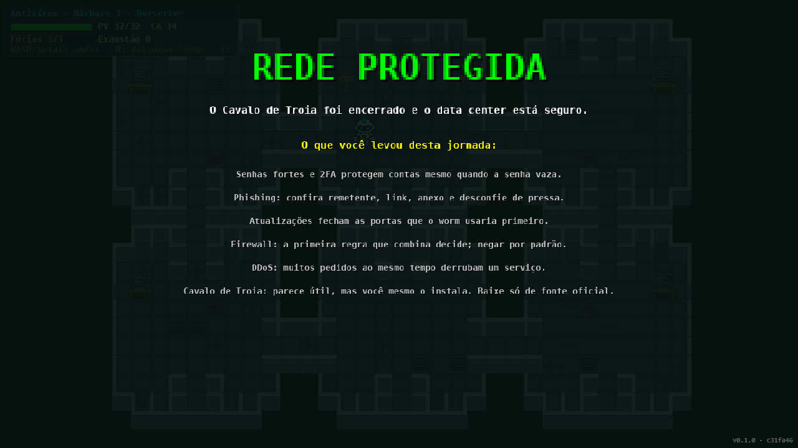

# Projeto Tuba · Game Design Document

**Versão do GDD:** {{VERSAO}} · **Data:** {{DATA}} · **Commit:** {{SHA}}
**Repositório:** <https://github.com/Cassian0S0ares/JOGOHTML>
**Jogar (produção):** <https://cassian0s0ares.github.io/JOGOHTML/> · **Homologação:** <https://cassian0s0ares.github.io/JOGOHTML/hml/>

> Documento vivo: toda mudança de mecânica entra aqui por pull request, e a pipeline gera o `GDD.pdf` a cada build. A estrutura segue o modelo de GDD do Framework Arcade.

| Campo | Valor |
|-------|-------|
| Nome do Squad | TODO |
| Nome do Jogo/Protótipo | Projeto Tuba |
| Data de submissão | TODO (até 21/10/2026) |
| Link do protótipo (build) | <https://cassian0s0ares.github.io/JOGOHTML/> (e `build.zip`, que roda offline) |
| Link do vídeo de inscrição | TODO |

| Integrante | Papel no projeto |
|------------|------------------|
| Guilherme Emanuel Gonçalves | Produto e Game Design |
| Cassiano Luiz Brandes Soares | Desenvolvimento e Qualidade |
| João Vitor Charleaux | Plataforma e Release |
| Davi Ferreira da Cunha | SRE e Segurança |

> O CPF de cada integrante vai só na cópia do GDD enviada ao concurso, nunca no repositório público (LGPD).

## 1. Premissa e problema endereçado

**Problema.** Conceitos de segurança da informação (vírus, phishing, atualizações, firewall, DDoS, Cavalo de Troia) costumam chegar a quem está começando em tecnologia como teoria seca, longe da prática. Ao mesmo tempo, o raciocínio de probabilidade, essencial em programação e em análise de risco, é visto como "matemática difícil". Quem não tem um professor ou um curso por perto fica sem porta de entrada.

**Público-alvo.** Estudantes do ensino médio e técnico e iniciantes em cursos de tecnologia (15 a 25 anos), sem pré-requisito de programação. O jogo roda no navegador de qualquer computador, sem instalação e sem cadastro.

**Por que gamificação.** Em vez de ler sobre phishing, o jogador marca as partes suspeitas de um e-mail; em vez de decorar o que é um firewall, ele decide quais pacotes passam numa esteira; em vez de ouvir que "Cavalo de Troia parece útil", ele é traído pelo aliado em quem confiou o jogo inteiro. O erro é seguro, imediato e explicado na hora, e cada vitória vem com uma "aulinha" curta.

**O que o jogador aprende.**

- Segurança digital: senhas e 2FA, phishing, atualizações, regras de firewall, DDoS e Cavalo de Troia, cada um num minijogo ou numa luta.
- Probabilidade aplicada: chance de acerto contra uma Classe de Armadura, vantagem e desvantagem (melhor ou pior de dois d20) e valor esperado de dano.
- Gestão de recursos: Fúrias, pontos de vida e exaustão como "orçamento" de defesa.

## 2. High concept

*Projeto Tuba* é um RPG de navegador em que você é o Antivírus, um bárbaro de armadura que entra num sistema infectado para limpá-lo. Cada sala tem um computador para proteger com um minijogo de segurança de verdade: quiz de boas práticas, caixa de entrada cheia de phishing, corrida de atualizações contra um worm e uma esteira de pacotes para filtrar com regras de firewall. Os vírus são enfrentados em combate por turnos com dados visíveis, inspirado em D&D 5e, onde cada escolha é um risco calculado. No data center, o simpático mago Firewall entra no seu time, até revelar que era o Cavalo de Troia, que rouba suas habilidades e usa contra você. O diferencial: o jogo ensina segurança pela experiência (você é enganado como uma vítima real seria) e ensina probabilidade pelos próprios dados do combate.

## 3. Gênero e plataforma

- **Gênero:** RPG educacional top-down com combate tático por turnos baseado em dados (D&D 5e simplificado), minijogos de segurança e minijogos de *timing* e ritmo.
- **Plataforma:** web desktop (navegador moderno, teclado e mouse). Roda também offline a partir do `build.zip`.
- **Tecnologia:** HTML5 Canvas e JavaScript puro, sem dependências em tempo de execução. O protótipo nasceu no GameMaker e foi portado para a web com um runtime próprio no estilo GameMaker (`js/runtime.js`). Site estático publicado no GitHub Pages por uma esteira CI/CD no GitHub Actions.

## 4. Mecânicas-core

**Loop principal.** Explorar a sala → proteger os computadores (minijogos de segurança) → enfrentar os vírus que perseguem o jogador → o chefe da sala desperta → vencê-lo e seguir para o próximo mundo. Cada inimigo derrotado dá uma "aulinha" sobre o tema da sala antes de sumir.

**Exploração.** WASD/Setas para andar, **E** para interagir com placas, computadores, o portal e o Firewall, **R** para descanso longo (5 s na fogueira: recupera PV, Fúrias e as magias do Firewall, mas só sem inimigo perseguindo). A tecla **7** liga o modo paz (só para testes: inimigos comuns param de perseguir; chefes não).

**Combate por turnos.**

- Iniciativa por d20 decide a ordem (antivírus, inimigo e, quando ele está no time, o Firewall).
- Ataque: d20 + bônus contra a CA do inimigo; 20 natural é crítico (dados de dano dobrados).
- **Fúria:** bônus de dano e resistência; termina se o jogador não atacar nem sofrer dano no turno. **Fúria Frenética** dá um ataque extra com a Ação Bônus, ao custo de 1 nível de exaustão.
- **Ataque Imprudente:** vantagem nos ataques, mas os inimigos também ganham vantagem.
- **Esquiva:** inimigos atacam com desvantagem.
- **Timing:** acertar o momento certo na barra dá bônus de dano; acertar o anel na defesa reduz o dano recebido.
- **Firewall (aliado, Mago 3):** Rajada de Fogo, Mãos Flamejantes, Raio Ardente, Poção de Brasa Viva e Esquiva. Antes de cada magia de dano vem o **ritmo das chamas** (4 notas, estilo osu!): 4 acertos dão +2d6 de fogo, 3 dão +1d4.
- Os inimigos têm ataque básico (Pseudópode, Garra Cristalina, Investida) e uma habilidade especial com recarga 5-6 no d6 (Cuspe Ácido, Cuspe Corrosivo, Chuva de Lascas).

**Minijogos dos computadores.**

| Sala | Minijogo | Conceito ensinado |
|------|----------|-------------------|
| Mundo 1 (4 computadores) | Quiz de 5 perguntas por sala: senhas e 2FA, phishing e engenharia social, malware e atualizações, redes e privacidade | Boas práticas de segurança do dia a dia |
| Mundo 2 · Caixa de Entrada | Marcar as partes suspeitas de 7 e-mails e decidir Confiar ou Quarentena | Identificar phishing (remetente, link, anexo, pressa) |
| Mundo 2 · Central de Atualizações | Escolher a ordem das atualizações enquanto um worm avança pela rede | Priorizar correções pelo que o ataque alcança primeiro |
| Mundo 2 · Regras do Firewall | Permitir ou bloquear pacotes numa esteira seguindo a lista de regras | A primeira regra que combina decide; negar por padrão; tráfego de saída suspeito |

**Progressão e curva de dificuldade.**

| Mundo | Ameaças | Chefe | Conceito |
|-------|---------|-------|----------|
| 1 · Masmorra | Vírus comum (CA 8, 22 PV) | **DDoS** (CA 7, 64 PV): um enxame que se divide em dois a cada turno; o timing do ataque decide quantos golpes e o jogador escolhe o pedaço alvo | Negação de serviço distribuída e botnets |
| 2 · Data center | Vírus de Elite (CA 13, 42 PV, multiataque), um por sala, que só acordam quando o Firewall entra no time | **Cavalo de Troia** (CA 14, 60 PV): o próprio Firewall tira a fantasia, rouba habilidades do antivírus a cada 3 turnos e usa contra ele | Cavalo de Troia, privilégio mínimo, defesa em camadas |

A dificuldade sobe em três eixos: inimigos mais resistentes, minijogos que pedem raciocínio (do quiz de múltipla escolha para a análise de e-mails, grafos de rede e regras em ordem) e chefes com mecânicas próprias. Em compensação, o jogador ganha um aliado (o Firewall) no mundo 2.

**Recompensas.** Não há pontuação numérica: a recompensa é a progressão (portas que abrem, o portal para o mundo 2, o descanso longo ao chegar num mundo novo) e o conhecimento, entregue nas aulinhas dos inimigos e na revisão final.

**Vitória e derrota.** Derrotar o chefe de um mundo faz sumir os inimigos que ainda estavam vivos. O chefe do mundo 1 abre um portal para o mundo 2; vencer o Cavalo de Troia leva à tela de fim de jogo. Se os PV do antivírus chegam a zero (ou a exaustão chega a 6), aparece a tela de game over e a sala reinicia (o portal e os computadores já protegidos do mundo 2 continuam como estavam).

## 5. Enredo e personagens

**Contexto.** Um sistema foi infectado. O Antivírus atravessa primeiro uma masmorra antiga, com placas e um campo de lápides, onde um DDoS está derrubando tudo, e depois um data center moderno, onde algo destruiu o laboratório do sudeste. Lá ele encontra o Firewall, um mago de fogo carismático que pede para entrar no time. As pistas de que há algo errado estão espalhadas: o Firewall fala de "turno da noite", de uma porta 4444 "fechada no turno dele", do ditado "cavalo dado não se olha os dentes", e os Vírus de Elite deixam bytes nos logs (0x54 0x52 0x4F 0x49 0x41 = "TROIA" em ASCII). Quando os três computadores do data center ficam protegidos, o Firewall agradece por ter ficado com a rede só para ele e revela ser o Cavalo de Troia.

| Personagem | Papel | Descrição |
|------------|-------|-----------|
| **Antivírus** (Senatir) | Protagonista | Bárbaro Berserker nível 3 de armadura. Curioso e direto, faz as perguntas que o jogador faria. |
| **Firewall** | Aliado e traidor | Mago de fogo nível 3, "Guardião Arcano das Portas Lógicas", campeão de assar marshmallow em servidor. Explica o que um firewall faz... e por que ele não deveria estar do seu lado, mas na porta. |
| **Vírus** | Inimigo comum (mundo 1) | Perseguem o jogador; derrotados, confessam como invadiam (senhas fracas, phishing, programas falsos). |
| **DDoS** | Chefe do mundo 1 | Enxame que fala em caixa alta e se divide a cada turno, como uma botnet. |
| **Vírus de Elite** | Inimigos do mundo 2 | Dormem até o Firewall entrar no time; deixam as pistas da traição. |
| **Cavalo de Troia** | Chefe final | O Firewall sem a fantasia. Rouba Fúria, Ataque Imprudente, Esquiva e Defesa sem Armadura e usa contra você. |

## 6. Fluxo do jogo

```
 ┌───────────────┐
 │ Abrir o link  │  (sem menu: o jogo começa direto no mundo 1)
 └───────┬───────┘
         v
 ┌───────────────────────┐   E no computador   ┌──────────────────────┐
 │  Mapa (exploração)    │ ──────────────────> │ Terminal (minijogo)  │
 │  HUD, placas, falas   │ <────────────────── │ Esc sai / concluiu   │
 └──┬──────────┬─────────┘                     └──────────────────────┘
    │ encostou │ R na fogueira
    │ no vírus v
    │   ┌──────────────┐
    │   │ Descanso 5 s │ ──> volta ao mapa
    │   └──────────────┘
    v
 ┌───────────────────┐  venceu   ┌────────────────────┐
 │ Combate por turnos│ ────────> │ Aulinha do inimigo │ ──> mapa
 │ (dados, timing,   │           └────────────────────┘
 │  ritmo do Firewall)│  fugiu ──> mapa (inimigo atordoado)
 └─────────┬─────────┘
           │ PV 0 ou exaustão 6
           v
 ┌───────────────────────┐  Enter  ┌─────────────────────┐
 │ Game over             │ ──────> │ A sala reinicia     │ ──> mapa
 │ "Sistema comprometido"│         └─────────────────────┘
 └───────────────────────┘

 Mundo 1: 4 computadores protegidos ──> DDoS desperta ──> venceu ──> portal
          ──> Mundo 2 (chegada = descanso longo) ──> conversa com o Firewall (escolhas)
          ──> 3 computadores protegidos ──> traição ──> Cavalo de Troia
          ──> venceu ──> última aulinha ──> Fim de jogo "Rede protegida" ──Enter──> recomeça no mundo 1
```

## 7. Level design

Cada mundo é uma room de uma tela (1366 × 768) com salas ligadas por corredores, desenhada no editor de rooms do GameMaker e exportada para `js/data.js` por `tools/build_assets.py`.

**Mundo 1 · Masmorra.** Quatro salas nos cantos, cada uma com um computador (quiz de um tema) e um vírus vagando; placas no centro dão pistas do mundo ("Eu vou em busca de duas"). Proteger os quatro computadores faz o DDoS surgir na sala do meio, embaixo; vencê-lo abre o portal no mesmo lugar.


**Mundo 2 · Data center.** O jogador chega na sala oeste, ao lado do Firewall. O salão central (racks) liga as salas: noroeste (Caixa de Entrada), nordeste (Central de Atualizações) e sudeste, o laboratório destruído (Regras do Firewall). Cinco Vírus de Elite estão espalhados e dormentes até o Firewall entrar no time. Com os três computadores protegidos, o Firewall leva o jogador ao meio do salão central, onde a luta final acontece.



## 8. Interface do usuário (UI/UX)

- **HUD (canto superior esquerdo):** nome e classe, barra de PV, CA, Fúrias, exaustão, a linha do Firewall quando ele está no time e os controles. **Versão do build** no canto inferior direito.
- **Falas:** caixa com retrato, máquina de escrever e escolhas (conversa com o Firewall).
- **Terminal de segurança:** tela de cada minijogo de computador, com placar e explicação de cada resposta.
- **Combate:** cenário, ficha de quem está agindo, menu de ações, dados animados e registro de combate com cada rolagem explicada (ex.: `Você: d20(14)+2 = 16`).
- **Game over:** "Sistema comprometido", com uma dica de combate; Enter reinicia a sala.
- **Fim de jogo:** depois da última aulinha do Cavalo de Troia, "Rede protegida" com a revisão do que o jogador aprendeu em cada ameaça; Enter recomeça do mundo 1.
- **Menu inicial:** não há; o jogo abre direto no mundo 1, e a primeira placa e a HUD mostram os controles.

| | |
|---|---|
|  |  |
|  |  |
|  |  |
|  |  |

**Acessibilidade.**

- Funciona em qualquer navegador moderno, sem instalação, sem cadastro e sem coletar nenhum dado pessoal.
- Todo o conteúdo é texto na tela; o único som é o dos dados, então o jogo é jogável sem áudio.
- Teclado ou mouse nos menus e minijogos (setas, números, Enter ou clique); textos com sombra e alto contraste sobre o fundo.
- O combate é por turnos: não exige reflexo. O timing dá bônus, mas errar não impede de jogar.
- Linguagem simples e com humor, sem jargão sem explicação; cada erro no minijogo vem com a explicação da resposta.
- Limites conhecidos (ver seção 12): sem remapeamento de teclas, sem ajuste de tamanho de fonte e só desktop.

## 9. Áudio e música

O protótipo tem apenas o efeito sonoro de rolagem de dados (`snd_dice_roll.ogg`), tocado a cada rolagem no combate. As músicas de mapa, combate e chefe foram removidas para não depender de material sem licença confirmada. Origem e licença de cada som estão em `THIRD_PARTY.md` (TODO: confirmar autor e licença do efeito de dados).

## 10. Arte e referências visuais

Pixel art em perspectiva top-down, com paleta escura e roxa nos vírus e tons quentes no Firewall; o cenário do combate é synthwave (grade neon e sol no horizonte). Sprites, tilesets e retratos estão inventariados em `THIRD_PARTY.md`.

| Referência | Autoria | O que inspirou | Licença / uso |
|------------|---------|----------------|---------------|
| *System Reference Document 5.1* (regras de D&D 5e) | Wizards of the Coast | Combate por turnos, fichas, Fúria, vantagem e desvantagem | CC BY 4.0 |
| *osu!* | ppy | Minijogo de ritmo das magias do Firewall | Só inspiração; nenhum material usado |
| GameMaker | YoYo Games | Protótipo original, portado para HTML5 | Ferramenta; o código e os ativos do projeto são do squad |
| Canvas API · MDN Web Docs | Mozilla | Renderização no navegador | Documentação, CC BY-SA 2.5 |

## 11. Uso de inteligência artificial e componentes de terceiros

| Ferramenta / Componente | Uso no projeto | Licença / Autorização |
|-------------------------|----------------|------------------------|
| Claude Code (Anthropic) | Código: esteira CI/CD, port do GameMaker para HTML/JS, testes, telas de fim, monitoramento; texto: documentação. Registro detalhado em `AI-USAGE.md` | Assinatura do squad; termos de uso permitem uso do resultado |
| TODO: ferramentas usadas na arte e nas referências, se houver | TODO | TODO |
| Sprites, tilesets, retratos e fonte bitmap | Arte do jogo | TODO (ver `THIRD_PARTY.md`) |
| `snd_dice_roll.ogg` | Efeito sonoro dos dados | TODO (ver `THIRD_PARTY.md`) |
| System Reference Document 5.1 | Regras de combate | CC BY 4.0 |
| eslint, vitest, @playwright/test, marked | Ferramentas de desenvolvimento e testes (não vão no build) | MIT / Apache-2.0 |

O jogo publicado não usa bibliotecas de terceiros. A lista completa de dependências e versões está no SBOM anexado a cada Release.

Declaramos que o Squad detém os direitos de uso sobre todos os materiais listados acima e que o conteúdo submetido não configura plágio ou violação de direitos autorais, marcários ou de propriedade intelectual de terceiros, nos termos do item 15 do Regulamento e do item 3 dos Termos e Condições de Participação.

## 12. Ideias adicionais e próximos passos

- **Menu inicial** com "Jogar", "Como jogar" e créditos.
- **Versão mobile:** controles de toque (direcional virtual e botões) e layout que caiba em tela de celular.
- **Acessibilidade:** remapeamento de teclas, tamanho de fonte ajustável e modo de alto contraste.
- **Salvar progresso** no próprio navegador (sem dados pessoais) para não recomeçar do mundo 1.
- **Mundo 3:** ransomware e engenharia social por telefone, com minijogo de backup 3-2-1.
- **Painel do professor:** contagem anônima e agregada de partidas e de minijogos concluídos, para medir o aprendizado sem identificar o jogador.
- Telemetria só anônima, seguindo a LGPD.

## Declaração de originalidade do Squad

Declaramos que este Game Design Document e o protótipo a ele associado são de autoria original do Squad indicado, observadas as licenças e autorizações de uso listadas na Seção 11, e que aceitamos integralmente o Regulamento Oficial e os Termos e Condições de Participação do Concurso FRAMEWORK ARCADE.

| Integrante | Assinatura |
|------------|------------|
| Guilherme Emanuel Gonçalves | |
| Cassiano Luiz Brandes Soares | |
| João Vitor Charleaux | |
| Davi Ferreira da Cunha | |

## Apêndice · Esteira

```
feature/* → PR (revisão + CI verde) → main
   │
   ├─ ci: lint · testes (JUnit + cobertura) · gitleaks · npm audit · SBOM
   │      build (dist/ + version.json) · GDD.pdf · build.zip + SHA-256
   ├─ deploy-hml: gh-pages/hml/ → E2E Playwright na URL de homologação
   ├─ deploy-prd: aprovação no environment "producao" → gh-pages/releases/<sha>/
   │              canário 10% → smoke → promoção (ou rollback automático)
   ├─ release (tag vX.Y.Z): GitHub Release com build.zip, checksum, SBOM e GDD.pdf
   ├─ monitor (a cada 15 min): sondas, alertas como Issues, painel /status/ e DORA
   └─ triagem (diária): reproduz a triagem do concurso e monta o pacote de submissão
```

Detalhes em `README.md` e nos workflows em `.github/workflows/`.
