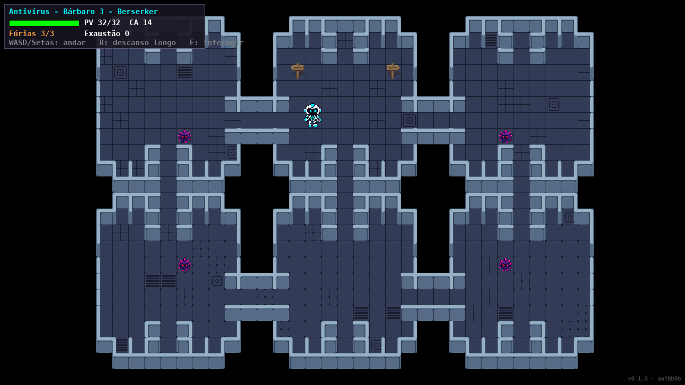

# Projeto Tuba · Game Design Document

**Versão do GDD:** {{VERSAO}} · **Data:** {{DATA}} · **Commit:** {{SHA}}
**Repositório:** <https://github.com/Cassian0S0ares/JOGOHTML>
**Jogar (produção):** <https://cassian0s0ares.github.io/JOGOHTML/> · **Homologação:** <https://cassian0s0ares.github.io/JOGOHTML/hml/>

> Documento vivo: toda mudança de mecânica entra aqui por pull request, e a pipeline gera o `GDD.pdf` a cada build.

## 1. Premissa

**Problema.** Conceitos de segurança da informação (vírus, malware, antivírus, boas práticas de defesa) costumam chegar a quem está começando em tecnologia como teoria seca, longe da prática. Ao mesmo tempo, o raciocínio de probabilidade, essencial em programação e em análise de risco, é visto como "matemática difícil".

**Proposta.** *Projeto Tuba* é um RPG de exploração e combate por turnos em que o jogador controla o **Antivírus**, um herói que percorre os setores de um sistema infectado e enfrenta vírus. Cada decisão de combate (atacar, entrar em Fúria, se esquivar, arriscar um Ataque Imprudente) é uma escolha de risco calculado, resolvida com dados visíveis na tela, como em D&D 5e.

**Público-alvo.** Estudantes do ensino médio e técnico e iniciantes em cursos de tecnologia (15 a 25 anos), sem pré-requisito de programação.

**O que o jogador aprende.**

- Noções de segurança digital: o que é um vírus, como ele se espalha pelo sistema e por que agir cedo reduz o dano.
- Probabilidade aplicada: chance de acerto contra uma Classe de Armadura, vantagem/desvantagem (melhor ou pior de dois d20) e valor esperado de dano.
- Gestão de recursos: Fúrias, pontos de vida e exaustão como "orçamento" de defesa.

## 2. Gênero e plataforma

- **Gênero:** RPG top-down com combate tático por turnos baseado em dados (D&D 5e simplificado) e minijogo de *timing*.
- **Plataforma:** web desktop (navegador moderno, teclado e mouse). Roda também offline a partir do `build.zip`.
- **Tecnologia:** HTML5 Canvas e JavaScript puro, sem dependências em tempo de execução; site estático publicado no GitHub Pages.

## 3. Mecânicas-core

**Loop principal.** Explorar a sala → encontrar um vírus (ele persegue o jogador quando o vê) → combate por turnos → recompensa ou derrota → descansar e seguir explorando.

**Exploração.** WASD/Setas para andar, **E** para interagir com placas e objetos, **R** para descanso longo (recupera PV e Fúrias, mas só sem inimigo por perto).

**Combate por turnos.**

- Iniciativa por d20 decide quem age primeiro.
- Ataque: d20 + bônus contra a CA do inimigo; 20 natural é crítico (dados de dano dobrados).
- **Fúria:** bônus de dano e resistência; termina se o jogador não atacar nem sofrer dano no turno.
- **Ataque Imprudente:** vantagem nos ataques, mas os inimigos também ganham vantagem.
- **Esquiva:** inimigos atacam com desvantagem.
- **Timing:** acertar o momento certo na barra dá bônus de dano.
- O vírus tem o *Pseudópode* e o *Cuspe Ácido*, que recarrega com 5+ no d6.

**Vitória e derrota.** Cada vírus derrotado é removido da sala; a fase é vencida com a sala limpa (a tela de fim de fase entra na v1.0.0). O jogador perde quando os PV chegam a zero, e a sala reinicia.

**Progressão (planejada para v1.0.0).** Setores com vírus mais resistentes; entre setores, uma tela de "relatório de incidente" explica o conceito de segurança da fase e mostra a probabilidade real das jogadas feitas.

| Fase | Ameaça | Conceito ensinado |
|------|--------|-------------------|
| 1 · Sala inicial | Vírus comum | O que é um vírus; chance de acerto com d20 |
| 2 · Setor de rede *(planejada)* | Worm (se replica) | Propagação; agir cedo; vantagem/desvantagem |
| 3 · Núcleo *(planejada)* | Ransomware | Backup e recuperação; gestão de recursos |

## 4. Telas



- **Menu:** *a definir (wireframe no Stitch).*
- **HUD:** nome e classe, barra de PV, CA, Fúrias, exaustão e controles (canto superior esquerdo); versão do build (canto inferior direito).
- **Combate:** cenário, log de rolagens, dados animados e menu de ações.
- **Fim de jogo:** mensagem de derrota e reinício da sala.

## 5. Referências

| Referência | Autoria | Licença / uso |
|------------|---------|---------------|
| *System Reference Document 5.1* (regras de D&D 5e) | Wizards of the Coast | CC BY 4.0 |
| GameMaker (protótipo original, portado para HTML5) | YoYo Games | Ferramenta; o código e os ativos do projeto são do squad |
| Canvas API · MDN Web Docs | Mozilla | Documentação, CC BY-SA 2.5 |

Os ativos de terceiros (sprites, sons e fontes) e as bibliotecas estão inventariados em `THIRD_PARTY.md`.

## 6. Esteira

```
feature/* → PR (revisão + CI verde) → main
   │
   ├─ ci: lint · testes (JUnit + cobertura) · gitleaks · npm audit · SBOM
   │      build (dist/ + version.json) · GDD.pdf · build.zip + SHA-256
   ├─ deploy-hml: gh-pages/hml/ → E2E Playwright na URL de homologação
   ├─ deploy-prd: aprovação no environment "producao" → gh-pages/releases/<sha>/
   │              canário 10% → smoke → promoção (ou rollback automático)
   └─ release (tag vX.Y.Z): GitHub Release com build.zip, checksum, SBOM e GDD.pdf
```

Detalhes em `README.md` e no workflow `.github/workflows/esteira.yml`.
